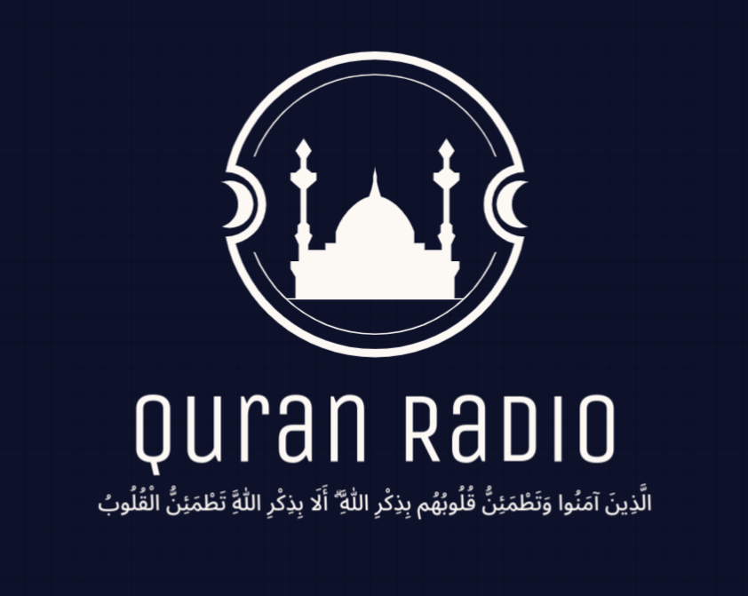

# Quran Radio (vscode-extension)

A simple vs code extension to listen to Quran recitation.

  

 

## Dependencies
- Install **vlc** as it is required for playing the audio.
  - Debian based distributions
`snap install vlc`
  - Windows
[Follow This link](https://www.videolan.org/vlc/download-windows.html)

## How to use?
### UI
- You can play and stop the radio from the **Quran Radio** button in the status bar.
### Commands
- press **F1** or **Ctrl+Shift+P** to open the command palette.
- Type **Quran Radio** and select the command you want to run.
  - play: play the radio.
  - stop: stop the radio.
  - changeRadio: change the radio station from a dropdown menu.